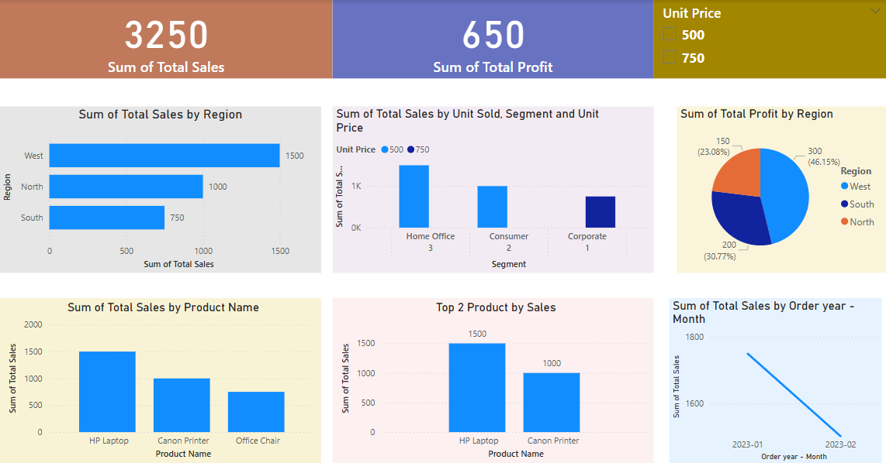

# Retail Sales Insights - SQL and Power BI

This project is created to analyze retail sales data using SQL and Power BI. The goal was to understand sales performance across different regions, products, and customer segments, and to build an interactive dashboard for business reporting.

## Tools Used

- MySQL: For creating the database, writing queries, and generating calculated columns.
- Power BI Desktop: For visualizing data, building charts, KPIs, and designing the final dashboard.
- GitHub: To store project files and share the work.

## Project Files

1. retail_sales_schema.sql – Contains SQL code to create tables and relationships (Customers, Products, Orders, Sales, Regions).
2. retail_sales_queries.sql – Includes analytical queries to find top products, regional performance, and monthly trends.
3. retail_sales_analysis.csv – The dataset used in Power BI.
4. retail_sales_dashboard.pbix – Final dashboard file built in Power BI.

Note: The `.pbix` file can only be viewed in Power BI Desktop.

## What This Dashboard Shows

- Total Sales and Profit summary
- Sales by Region and Segment
- Unit Sold and Unit Price analysis
- Top 2 products by sales
- Month-wise sales trend
- Pie chart showing profit share by region

## How I Built This

1. First, created the SQL schema and inserted sample data.
2. Wrote SQL queries to find insights (e.g., highest selling product, revenue by region).
3. Exported the data to CSV and loaded it into Power BI.
4. Designed an interactive dashboard using bar charts, KPIs, pie charts, and slicers.

## Key Takeaways

- Learned to create data models using SQL.
- Used DAX in Power BI to create calculated fields.
- Improved skills in building dashboards with real-time filters.
- Understood how to connect backend queries with front-end reporting.

## Resume Point
Created a Retail Sales Analysis dashboard using MySQL and Power BI. Designed the database, wrote queries for business metrics, and built a Power BI report to visualize total sales, profit, and top-performing products by region and time.

## 📊 Dashboard Preview

                                                                                       Data isn't just numbers - it's stories waiting to be told.

